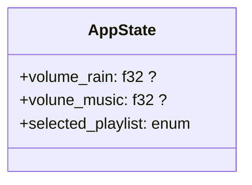

# Basic planning

## to do 

#### v.0.0.1 proto ui
- add blocking ui
- add proto basic volume
- add proto hour
- add proto selector
- add mock icon

#### v.0.0.2 proto music
- add app state
- add basic rain player
- connect volume logic

#### v.0.0.3 proto playlist
- add music 
  - 
  - hour logic
  - multiple music logic

#### v.0.0.4 main ui polish
- choose art style
- add music slider
- add other playlist
- add background

#### v.0.0.5 town music
...

#### other features
- add setting
- add ci
- building
  - add github page
  - add exe build
  - add flatpak build
  - add extension build
  - add cd ? 

